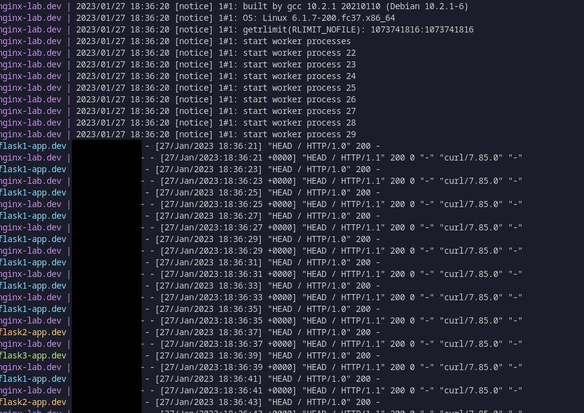

# Docker NGINX Playground

This is a Docker project orchestrating an NGINX Load Balancer to handle multiple requests.

## Context

This is an useful project for using when you need a lab for testing your backends behind a load balanacer.

This lab has the following structure:

### **Docker/docker-compose**:

**NGINX:**

```bash
    nginx
    ├── conf
    │   ├── conf.d
    │   │   ├── default.conf
    │   │   └── flask.conf
    │   └── nginx.conf
    └── Dockerfile
```

**Application (flask as *example*):**

```bash
    app
    ├── app.py
    ├── Dockerfile
    └── requirements.txt
```

You can add or modify [NGINX virtualhosts](https://www.nginx.com/resources/wiki/start/topics/examples/server_blocks/) inside of `conf.d` according to your environment, customizing the `nginx.conf` as well.

I have used my [flask docker project](https://hub.docker.com/repository/docker/alexmbarbosa/flask-python3/general) as backend app, feel free to change it using your own source-code.


## How to use this lab

* Clone this project:

```sh
https://github.com/alexmbarbosa/nginx-lab-dev.git
```

* Add/change your virtualhost uploading in:
    * `nginx/conf/conf.d`

* With your code confs done, run `docker-compose`:

```sh
docker-compose up -d
```



---
### **Author:** Alex Mendes

**LinkedIn:** https://www.linkedin.com/in/mendesalex/

### **References:**

* [How to Use the NGINX Docker](https://www.docker.com/blog/how-to-use-the-official-nginx-docker-image/)
* [Using nginx as HTTP load balancer](http://nginx.org/en/docs/http/load_balancing.html)
* [NGINX Full Example Configuration](https://www.nginx.com/resources/wiki/start/topics/examples/full/)